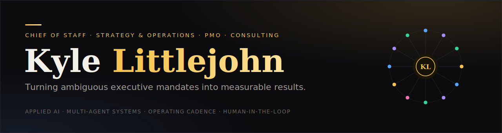

  <a href="https://kylelittlejohn.com/">
    <picture>
      <source media="(prefers-color-scheme: dark)" srcset="assets/banner-dark.svg">
      <source media="(prefers-color-scheme: light)" srcset="assets/banner-light.svg">
      
    </picture>
  </a>

I turn ambiguous executive mandates into systems other people can execute against. 12+ years across Chief of Staff, Strategy, PMO, and Consulting, now building applied-AI operating systems that do the same work.

### 🛠 Currently building

**[Executive Office ↗](https://github.com/khlittlejohn-hue/executive-office)** &nbsp;·&nbsp; A 12-department, 100+ agent operations system I designed and run on Claude Code: multi-agent orchestration, a 14-stage adversarial QC pipeline, render-time invariants that fail the build on a wrong number, and a human on every decision that leaves the system. The clearest single artifact of how I think about systems.

<!-- latest:start -->
🛠 **Latest:** `pushed changes` in [`khlittlejohn-hue.github.io`](https://github.com/khlittlejohn-hue/khlittlejohn-hue.github.io) · 12m ago
📡 **executive-office** last updated 2h ago

Auto-updated from my public GitHub activity · last run Jul 17, 2026
<!-- latest:end -->

### What I do

- **Applied AI.** Orchestration, agent design, workflow automation. The operator's side of AI, not model training.
- **Strategy & operations.** Turning a goal into a pipeline that holds up under volume.
- **Bias toward systems.** Name the roles, separate the work, make the invariants fail loud.

Open to **Chief of Staff, Strategy, and Operations** roles where systems thinking is the job, not a nice-to-have.

📍 New York · Sydney · Remote

---

**Find me:** &nbsp; [Website ↗](https://kylelittlejohn.com/) &nbsp;·&nbsp; [LinkedIn ↗](https://www.linkedin.com/in/kyle-littlejohn-) &nbsp;·&nbsp; [khlittlejohn@gmail.com](mailto:khlittlejohn@gmail.com)
